# KubeAid CLI - Architecture

> A GitOps-native, multi-cloud Kubernetes provisioning tool.
> Go • ClusterAPI • ArgoCD • AWS / Azure / Hetzner / KubeOne

**License:** AGPL-3.0 &nbsp;•&nbsp; **Container:** `ghcr.io/obmondo/kubeaid-core` &nbsp;•&nbsp; **Source:** [Obmondo/kubeaid-cli](https://github.com/Obmondo/kubeaid-cli)

---

## Who should read this

This document is the single entry point for understanding how KubeAid CLI is put together. It is written for three audiences:

- **Operators** who want to know what the tool does before trusting it with a production cluster.
- **Contributors** who need to find the right file to edit for a given feature.
- **Integrators** who are adding a new cloud provider, template, or addon.

If you only want to *use* the CLI, start at the [README](../README.md). This doc assumes you already understand Kubernetes, ClusterAPI, and GitOps at a conceptual level.

## Table of contents

1. [Introduction](#1-introduction)
2. [Architecture at a glance](#2-architecture-at-a-glance)
3. [Two-binary model](#3-two-binary-model)
4. [Bootstrap flow](#4-bootstrap-flow)
5. [Cloud providers](#5-cloud-providers)
6. [Configuration system](#6-configuration-system)
7. [Template engine](#7-template-engine)
8. [GitOps with ArgoCD](#8-gitops-with-argocd)
9. [Hetzner storage planning & OS install](#9-hetzner-storage-planning--os-install)
10. [Cluster lifecycle](#10-cluster-lifecycle)
11. [Codebase map](#11-codebase-map)
12. [Development guide](#12-development-guide)

---

## 1. Introduction

KubeAid CLI provisions, upgrades, tests, and recovers production Kubernetes clusters across multiple clouds, from a single YAML config. Everything it does eventually lands as commits in a Git repository called **KubeAid Config**, and [ArgoCD](https://argo-cd.readthedocs.io/) reconciles that repository onto the target cluster.

**What makes it different:**

- **GitOps-native.** Day-2 operations are Git commits, not `kubectl apply`.
- **One config, many clouds.** The same `general.yaml` shape provisions AWS, Azure, Hetzner, or bare-metal clusters.
- **Opinionated addon stack.** Cilium, Cert-Manager, Sealed Secrets, KubePrometheus, Rook-Ceph, Velero - pre-wired.
- **Self-managing result.** After `clusterctl move`, the target cluster manages itself; the bootstrap environment can be thrown away.

**Supported providers:**

| Provider            | Provisioning           | Management cluster   |
| ------------------- | ---------------------- | -------------------- |
| AWS                 | ClusterAPI (CAPA)      | K3D (local)          |
| Azure               | ClusterAPI (CAPZ) + CrossPlane | K3D (local) |
| Hetzner HCloud      | ClusterAPI (CAPH)      | K3D (local)          |
| Hetzner bare metal  | ClusterAPI (CAPH) + Robot API | K3D (local)   |
| Hetzner hybrid      | ClusterAPI (CAPH)      | K3D (local)          |
| Generic bare metal  | KubeOne                | None (direct)        |

---

## 2. Architecture at a glance

Five diagrams. Each zooms in on one concern; together they cover the whole system.

### 2.1 System overview

```mermaid
%%{init: {'flowchart': {'htmlLabels': false}}}%%
flowchart LR
  subgraph U["User workstation"]
    CFG["general.yaml + secrets.yaml"]
    THIN["kubeaid-cli (thin client)"]
  end

  subgraph CT["Docker: ghcr.io/obmondo/kubeaid-core"]
    CORE["kubeaid-core (engine)"]
    K3D["K3D management cluster"]
  end

  subgraph CLOUD["Cloud / infra APIs"]
    AWS["AWS"]
    AZ["Azure"]
    HZ["Hetzner HCloud + Robot"]
    BM["Bare metal (KubeOne)"]
  end

  subgraph GIT["GitOps"]
    REPO["KubeAid Config Git repo"]
    ARGO["ArgoCD on target cluster"]
  end

  CFG --> THIN
  THIN -- "docker run + volume mounts" --> CORE
  CORE --> K3D
  K3D -- "clusterctl / CAPI" --> CLOUD
  CORE -- "render + git push" --> REPO
  REPO -- "sync" --> ARGO
  ARGO -- "manages addons" --> CLOUD

  classDef user fill:#eef2ff,stroke:#4f46e5,color:#1e1b4b;
  classDef engine fill:#ecfeff,stroke:#0891b2,color:#083344;
  classDef cloud fill:#fef3c7,stroke:#d97706,color:#451a03;
  classDef gitops fill:#dcfce7,stroke:#16a34a,color:#052e16;
  class CFG,THIN user;
  class CORE,K3D engine;
  class AWS,AZ,HZ,BM cloud;
  class REPO,ARGO gitops;
```

### 2.2 Bootstrap sequence

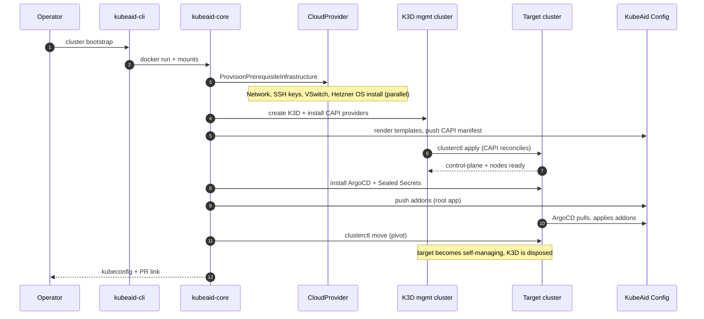

### 2.3 Config → templates → GitOps data flow

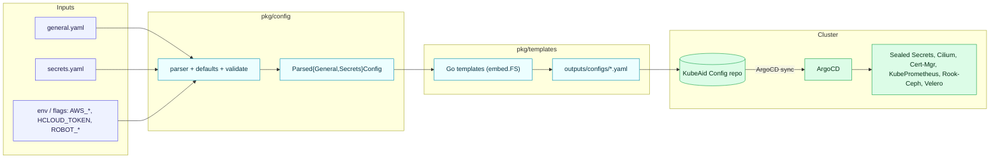

---

## 3. Two-binary model

KubeAid ships three binaries with very different scopes. Only one is installed on the operator's machine; the rest run inside a container or directly on bare-metal hosts.

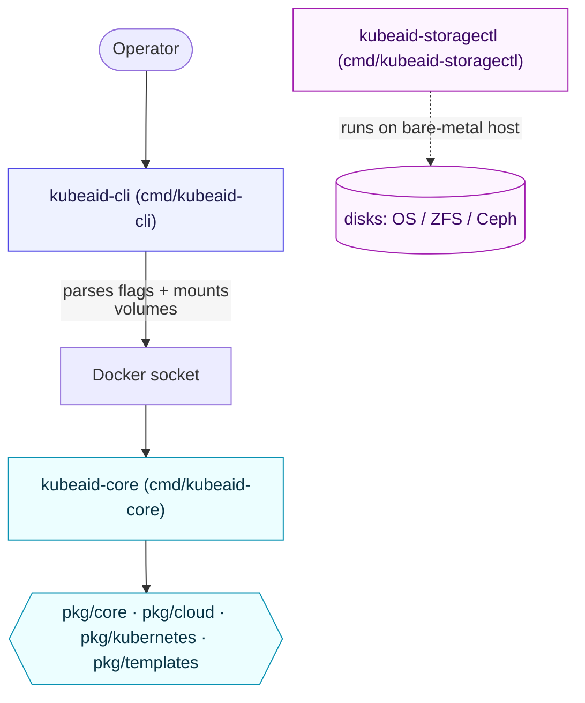

| Binary                | Role                              | Where it runs             | Size   |
| --------------------- | --------------------------------- | ------------------------- | ------ |
| `kubeaid-cli`         | Thin front-end: parses CLI flags, mounts config/sockets, launches the engine container. | Operator workstation | small  |
| `kubeaid-core`        | The actual engine: CAPI, ArgoCD, templates, cloud SDKs. | Inside the container image. | large  |
| `kubeaid-storagectl`  | Applies storage plans (disk partition, ZFS pool, Ceph prep) | On each bare-metal host | small  |

The split exists so operators do not need to install Go, CAPI providers, `kubectl`, `clusterctl`, `helm`, or any SDK on their machine. They only need Docker and `kubeaid-cli`.

---

## 4. Bootstrap flow

`kubeaid-core cluster bootstrap` is the most important code path. It runs four phases sequentially. Entry point: [pkg/core/bootstrap_cluster.go](../pkg/core/bootstrap_cluster.go).

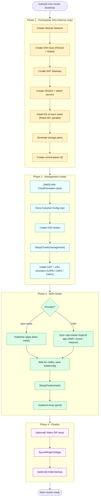

### Why only Hetzner has a "prerequisite infra" phase

AWS and Azure are provisioned declaratively by ClusterAPI + CrossPlane. Hetzner bare-metal has no such provider - networks, VSwitches, and OS installs must be done imperatively via the Robot API before CAPH can reconcile machines.

### The pivot

After Phase 3, the target cluster hosts its own CAPI controllers and ArgoCD. `clusterctl move` transfers all CAPI custom resources from the K3D management cluster to the target, and the K3D cluster can be disposed.

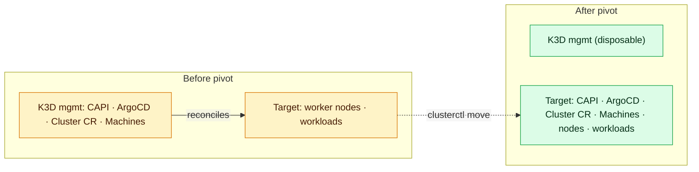

---

## 5. Cloud providers

Every provider implements the [`CloudProvider`](../pkg/cloud/cloud_provider.go) interface. The interface is deliberately small - it only covers operations that differ meaningfully between clouds; provisioning is delegated to ClusterAPI/KubeOne, and addons to ArgoCD.

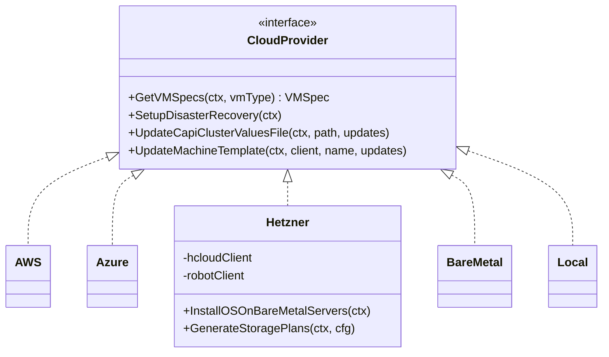

| Provider  | Package                                 | Distinctive work                                           |
| --------- | --------------------------------------- | ---------------------------------------------------------- |
| AWS       | [`pkg/cloud/aws`](../pkg/cloud/aws)     | CloudFormation IAM stack; CAPA provider                    |
| Azure     | [`pkg/cloud/azure`](../pkg/cloud/azure) | CrossPlane provisions resource group, VNet, OIDC blob; Workload Identity |
| Hetzner   | [`pkg/cloud/hetzner`](../pkg/cloud/hetzner) | Network, VSwitch, NAT GW, failover IP; Robot API for bare-metal OS install and storage plans |
| BareMetal | embedded in core (KubeOne)              | No CAPI; `kubeone apply` runs directly against target hosts |
| Local     | not applicable                          | The K3D management cluster *is* the main cluster            |

---

## 6. Configuration system

Two YAML files drive everything: `general.yaml` (shape of the cluster) and `secrets.yaml` (API tokens, SSH keys). They are parsed, defaults are filled in, the result is validated, and the parsed structs become globals for the rest of the run.

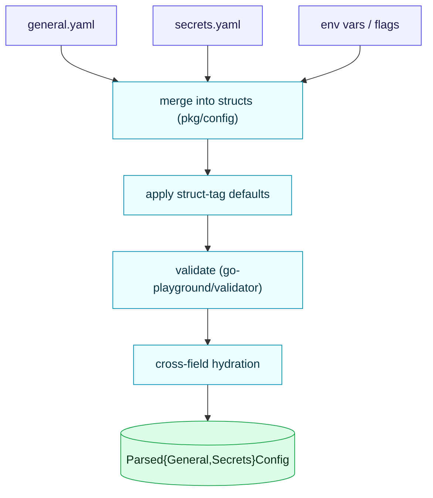

**Key files:**

- [pkg/config/general.go](../pkg/config/general.go) - `GeneralConfig` struct tree.
- [pkg/config/secrets.go](../pkg/config/secrets.go) - `SecretsConfig` struct tree.
- [pkg/config/parser.go](../pkg/config/parser.go) - orchestrates parse → defaults → validate → hydrate.

**Top-level `GeneralConfig` fields:**

| Field            | Purpose                                                       |
| ---------------- | ------------------------------------------------------------- |
| `Git`            | KubeAid Config repo URL, branch, credentials reference        |
| `Cluster`        | Name, Kubernetes version, pod/service CIDRs, feature flags    |
| `Cloud`          | Discriminated union: exactly one of `aws`/`azure`/`hetzner`/`bareMetal`/`local` |
| `Forks`          | Optional forks of KubeAid/KubeAid-Config repos                |
| `MonitoringSetup`| KubePrometheus, Grafana, alerting config                      |
| `DisasterRecovery`| Velero backup target (S3/Azure Blob)                         |

### Why a two-file split?

`general.yaml` is expected to land in Git (the KubeAid Config repo itself). `secrets.yaml` stays on the operator's machine and is referenced via Sealed Secrets inside the cluster.

---

## 7. Template engine

Go templates ([`pkg/templates`](../pkg/templates)) embed every YAML manifest the CLI will ever emit. At runtime, templates are rendered with `ParsedGeneralConfig` as their data context and written into `outputs/configs/*.yaml`, which is the working copy of the KubeAid Config repo.

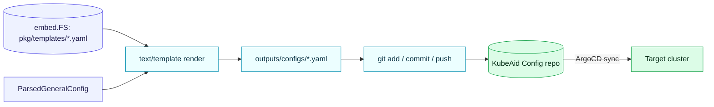

**Template categories:**

| Category             | Example output path                                       | Purpose                                |
| -------------------- | --------------------------------------------------------- | -------------------------------------- |
| CAPI cluster         | `argocd-apps/capi-cluster/values.yaml`                    | Cluster CR, control-plane, node groups |
| ArgoCD apps          | `argocd-apps/<addon>/Chart.yaml`, `values.yaml`           | One directory per addon                |
| Root app             | `argocd-apps/root/templates/*.yaml`                       | App-of-apps manifest                   |
| Sealed Secrets       | `sealed-secrets/*.yaml`                                   | Encrypted secret material              |
| KubeOne (bare metal) | `kubeone.yaml`                                            | Direct install manifest                |

Rendering is deterministic: re-running `bootstrap` on the same config regenerates the same files byte-for-byte, which makes the PR workflow reviewable.

---

## 8. GitOps with ArgoCD

KubeAid uses the **app-of-apps** pattern. A single "root" ArgoCD Application manages many child Applications, each representing one addon.

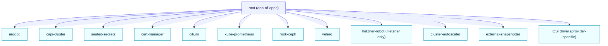

**Why app-of-apps?** Operators only hand ArgoCD one manifest (`root`); every other addon is reconciled transitively. Enabling or disabling an addon is a one-line flip in `general.yaml`.

**Related code:**

- [pkg/kubernetes/argocd](../pkg/kubernetes/argocd) - ArgoCD install, client, sync helpers.
- [pkg/constants/constants.go](../pkg/constants/constants.go) - `ArgoCDApp*` names.
- [pkg/core/setup_cluster.go](../pkg/core/setup_cluster.go) - the sync orchestration.

---

## 9. Secrets & identity flow

One of the most important architectural properties of KubeAid CLI is that **no long-lived secret is ever committed to Git**. There are two parallel flows: user-provided secrets (API tokens, SSH keys, registry creds) go through Sealed Secrets; cloud access for in-cluster controllers goes through provider-native identity (Workload Identity on Azure, IRSA on AWS, Basic Auth on Hetzner Robot). Both flows converge at the target cluster without leaving plaintext material in the KubeAid Config repo.

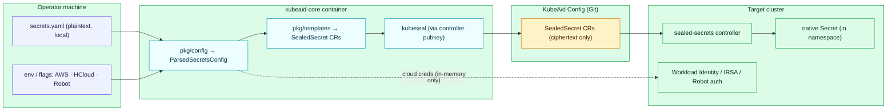

**Two-plane model:**

| Plane               | Source                          | Transit                                   | At rest in cluster         |
| ------------------- | ------------------------------- | ----------------------------------------- | -------------------------- |
| User secrets        | `secrets.yaml` on operator host | Encrypted by `kubeseal` → Git → ArgoCD    | `Secret` decrypted by controller |
| Cloud identity (AWS) | CLI flags / env                | Used to bootstrap; then CAPA/IRSA takes over | IAM role assumed by pod identity |
| Cloud identity (Azure) | CLI flags / env              | Used to create CrossPlane + UAMI; then Workload Identity | Federated token, no secret stored |
| Cloud identity (Hetzner) | `ROBOT_USER`/`ROBOT_PASSWORD` + `HCLOUD_TOKEN` | Mounted into kubeaid-core; wired to `hetzner-robot` addon via SealedSecret | Controller reads SealedSecret |

**Why this matters:**

- **Git repo is safe to share.** The KubeAid Config repo contains only manifests and ciphertext; operators can open PRs, grant team-wide read access, or mirror it publicly without leaking credentials.
- **Rotation is surgical.** Rotating a cloud credential means editing `secrets.yaml` and re-running `bootstrap` (or a dedicated rotation command). The sealed-secrets controller's keypair is the only long-lived secret, and it is backed up by the `backup-sealed-secrets` CronJob.
- **Disaster recovery preserves identity.** Velero backs up the sealed-secrets controller's private key; a recovered cluster can decrypt the same SealedSecret manifests from Git without operator intervention.
---

## 10. Cluster lifecycle

Every lifecycle command has its own entry point under [pkg/core](../pkg/core). The commands share configuration parsing, template rendering, and ArgoCD sync; they differ in which subset of phases they run.

| Command                  | Entry point                                                     | What it does                                         |
| ------------------------ | --------------------------------------------------------------- | ---------------------------------------------------- |
| `cluster bootstrap`      | [bootstrap_cluster.go](../pkg/core/bootstrap_cluster.go)        | Four-phase provision (see §4)                        |
| `cluster upgrade`        | [upgrade_cluster.go](../pkg/core/upgrade_cluster.go)            | Bump K8s version: update values file, recreate MachineTemplates, rolling replace |
| `cluster test`           | [test_cluster.go](../pkg/core/test_cluster.go)                  | Smoke-test a provisioned cluster (Cilium, DNS, storage) |
| `cluster delete`         | [delete_cluster.go](../pkg/core/delete_cluster.go)              | Delete Cluster CR, wait for CAPI cleanup, tear down infra |
| `cluster recover`        | [recover_cluster.go](../pkg/core/recover_cluster.go)            | Restore from Velero backup onto a fresh cluster       |

The shared primitives - create dev env, setup cluster, setup KubeAid Config - live alongside them ([create_dev_env.go](../pkg/core/create_dev_env.go), [setup_cluster.go](../pkg/core/setup_cluster.go), [setup_kubeaid_config.go](../pkg/core/setup_kubeaid_config.go)).

---

## 11. Codebase map

```text
kubeaid-cli/
├── cmd/
│   ├── kubeaid-cli/         # Thin client (docker run wrapper)
│   ├── kubeaid-core/        # Engine entry point + Cobra commands
│   └── kubeaid-storagectl/  # Bare-metal storage plan executor
├── pkg/
│   ├── core/                # Lifecycle orchestration (bootstrap, upgrade, delete…)
│   ├── cloud/
│   │   ├── aws/             # IAM, CAPA wiring
│   │   ├── azure/           # CrossPlane, OIDC, Workload Identity
│   │   ├── hetzner/         # Network, VSwitch, Robot API, storage plans
│   │   └── cloud_provider.go
│   ├── kubernetes/
│   │   ├── argocd/          # ArgoCD client, install, sync
│   │   ├── capi/            # ClusterAPI helpers, clusterctl move
│   │   └── ...
│   ├── config/              # GeneralConfig, SecretsConfig, parser, validator
│   ├── templates/           # embed.FS of Go templates
│   ├── constants/           # Shared names, env vars, flag names, timeouts
│   ├── globals/             # Process-wide state (parsed configs, CP instance)
│   └── utils/
│       ├── assert/          # Fail-fast helpers (os.Exit on error)
│       ├── git/             # Clone, commit, PR
│       ├── commandexecutor/ # Run external CLIs (kubeone, clusterctl, helm)
│       ├── kubernetes/      # Client factories, apply, wait
│       ├── logger/          # slog setup, context-attached attrs
│       └── templates/       # Template rendering primitives
├── docs/                    # This file + per-feature guides
├── tools/generators/        # Code generation for config schema
└── Makefile                 # Build, lint, image, run targets
```

**Global state** lives in [pkg/globals/globals.go](../pkg/globals/globals.go) - intentionally small: the cloud provider instance, parsed configs, the ArgoCD client, and a handful of cloud-specific handles. New state should have a strong reason before going here.

**Error handling** is fail-fast. [pkg/utils/assert](../pkg/utils/assert) wraps `assert.AssertErrNil` / `assert.Assert` and exits the process with a structured log line on any unexpected failure. This keeps call sites free of repetitive error-plumbing while still producing readable incident logs.

---

## 12. Development guide

### 12.1 Build

All build targets live in the [Makefile](../Makefile). Version, commit, and build date are injected into the binary via `-ldflags -X`.

| Target                     | Output                                                   |
| -------------------------- | -------------------------------------------------------- |
| `make build-cli`           | `./build/kubeaid-cli` (CGO-off, ready to ship)           |
| `make build-kubeaid-core`  | `./build/kubeaid-core`                                   |
| `make build-kubeaid-storagectl` | `./build/kubeaid-storagectl`                        |
| `make build-image`         | Docker image `ghcr.io/obmondo/kubeaid-core:<version>`    |
| `make run-container`       | Build image then run it with local mounts (dev loop)     |
| `make lint`                | `golangci-lint run ./...`                                |
| `make format`              | `golangci-lint fmt` - imports, golines, etc.             |
| `make addlicense`          | Adds AGPL-3 headers to any Go file that lacks one        |
| `make run-generators`      | Regenerates config artifacts from the struct definitions |

### 12.2 Local dev loop

```bash
# 1. Edit code.
# 2. Rebuild the container once; thereafter your local source is mounted in.
make build-image
make run-container
# 3. Iterate: edit → re-run command inside the container.
```

### 12.3 Coding standards

- Follow Google's [Go style decisions](https://google.github.io/styleguide/go/decisions) and [best practices](https://google.github.io/styleguide/go/best-practices).
- Run `make lint` and `make format` before pushing; CI is strict.
- Fail fast via [pkg/utils/assert](../pkg/utils/assert) instead of bubbling errors up through every caller.
- Use `log/slog` everywhere; attach per-entity attrs with `logger.AppendSlogAttributesToCtx` so parallel flows remain filterable.

### 12.4 Contributing

1. Open an [issue](https://github.com/Obmondo/kubeaid-cli/issues) describing the problem or feature.
2. Fork the repo and create a topic branch.
3. Run `make lint` and any relevant tests (`go test ./...`).
4. Open a PR that references the issue; describe the why in the body, not just the what.
5. For multi-step features, include a short architecture note in [docs/](.)

### 12.5 External references

- [ClusterAPI book](https://cluster-api.sigs.k8s.io/)
- [Hetzner Robot webservice API](https://robot.hetzner.com/doc/webservice/en.html)
- [ArgoCD docs](https://argo-cd.readthedocs.io/)
- [KubeOne docs](https://docs.kubermatic.com/kubeone/)
- [KubeAid (the upstream Helm/ArgoCD library)](https://github.com/Obmondo/KubeAid)
