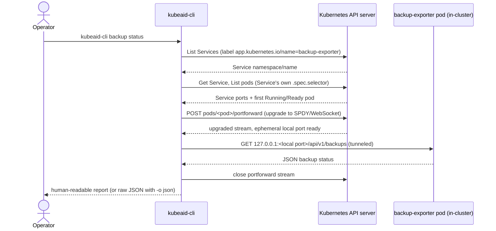

# `backup status`

## Overview

`kubeaid-cli backup status` reports the backup health of a KubeAid managed cluster —
CNPG (PostgreSQL) and Velero (volume/PVC) backups — as observed by the in-cluster
[backup-exporter](https://github.com/Obmondo/backup-exporter). It's a read-only report:
nothing is modified on the cluster or in Git.

## Purpose

Backup health lives in Prometheus metrics scraped from backup-exporter, which is fine for
alerting but awkward to check by hand — an operator has to know the metric names and
reconcile a handful of gauges into "is this resource actually backed up." backup-exporter's
`GET /api/v1/backups` endpoint already does that reconciliation server-side and returns one
evaluated status per resource. `backup status` is a thin client for that endpoint:
fetch, adjust the ages for time elapsed since collection, and print.

## Behavior

1. Builds a Kubernetes client from the current kubeconfig — the same one `kubectl` would use
   (`$KUBECONFIG`, else `~/.kube/config`, current context).
2. Finds backup-exporter's Service by label (`app.kubernetes.io/name=backup-exporter`) across
   all namespaces. Zero or more than one match is a hard error naming the namespace(s)
   involved.
3. Resolves a target pod behind that Service: lists pods matching the Service's own
   `.spec.selector` and picks the first one that's `Running` with a `Ready=True` condition.
   Then resolves the Service's port (named `http`, or its only port either way) to a container
   port on that pod — numeric `targetPort` used directly, a named one looked up by container
   port name.
4. Fetches `GET /api/v1/backups` the same way `kubectl port-forward` does: opens the
   `pods/portforward` subresource (an upgraded SPDY/WebSocket stream, not a plain HTTP proxy
   hop), forwards an ephemeral local port to the pod's resolved target port, issues the GET
   against `127.0.0.1`, then tears the tunnel down. No `kubectl` binary is required — this
   dials the same subresource client-go itself, not a spawned child process.
5. Renders the response:
   - `-o json` prints the response body verbatim, byte for byte, as returned by the server.
   - Otherwise, prints a human-readable report (see below).

Exit code is non-zero only when the fetch or decode itself fails (bad kubeconfig, Service or
pod not found, network error, malformed JSON). A cluster full of `exceeds_rpo` or `no_backup`
resources still exits `0` — this is a report, not a health gate; wire it into alerting
separately if you want it to fail a pipeline.

### Why port-forward, not the Service proxy subresource

An earlier version of this command fetched through the API server's `services/proxy`
subresource (`GET .../services/http:backup-exporter:8080/proxy/...`) — the same path
`kubectl proxy` uses. That breaks for clusters reached through an L7 proxy in front of
kube-apiserver, such as KubeAid's netbird `ClusterProxy`: it returns `404` for
`services/.../proxy/...` requests specifically, even though the apiserver itself is otherwise
fully reachable through it. `pods/portforward` upgrades to a raw SPDY/WebSocket stream instead
of an HTTP proxy hop, which is the mechanism such proxies are built to pass through — it's how
plain `kubectl port-forward` already works everywhere these clusters are accessed from.

### Human-readable report

```
collected 87m ago: cnpg | velero

Operator errors:
  cnpg: s3_list_failed

NAMESPACE    RESOURCE       TYPE           STREAM    METHOD        LATEST AGE   STATUS
demo         demo-pgsql     cnpg_cluster   logical   -             none         no_backup
demo         demo-pgsql     cnpg_cluster   wal       -             159m         healthy
demo         demo-uploads   pvc            volume    kopia         13h          healthy
monitoring   obs-postgres   cnpg_cluster   logical   -             none         no_backup
monitoring   prom-data      pvc            volume    CSISnapshot   13h          healthy
3 healthy, 2 no_backup
```

- One freshness line for all operators, condensing to `collected 87m ago: cnpg | velero` when
  they agree. Operators whose collections disagree are listed individually
  (`collected: velero 5m ago | cnpg never`); one that has never completed a run reads `never`
  rather than being omitted.
- Operator errors — collector failures with no single resource to attach to, e.g. Velero
  failing to list its S3 bucket — print prominently, before the table.
- The table is plain aligned columns, the same shape `kubectl get` prints: no borders, no
  colour, one row per backup stream per resource, sorted by namespace then resource name. A
  CNPG cluster contributes one row per stream (`logical`, `wal`). The `METHOD` column (Velero's
  `PodVolumeBackup` / `CSISnapshot` / `kopia`) only appears when at least one row has one.
- Staying line-oriented keeps the report greppable: `backup status | grep -v healthy` leaves
  every failing row complete, namespace included.
- `LATEST AGE` is humanized and adjusted for time elapsed since that operator's last
  collection — backup-exporter measures ages at collection time, not request time, so a stale
  collector under-reports without this adjustment. `-` means no series was published for that
  age (nothing to measure yet); `none` means a series was published reporting exactly zero —
  the operators' shared "no backup exists" sentinel.
- `STATUS` is one of `healthy`, `exceeds_rpo`, `no_backup`, `collector_error`, `unknown`; a
  `collector_error` row also shows the failure reason in parentheses.
- The summary line always counts every resource, ordered healthy first.

## Configuration

Nothing feature-specific. The Service is discovered dynamically by label — there is no
`general.yaml` field for a namespace or Service name, and no CLI flag duplicates that
discovery. The only flag is `-o`/`--output`, which accepts `json` or is omitted.

Unlike the `cluster` subcommands, the `backup` group has no config-parsing
`PersistentPreRun`: no `general.yaml`/`secrets.yaml` is read at all. The command connects
with your current kubeconfig, exactly like kubectl (`$KUBECONFIG`, else `~/.kube/config`,
current context) -- if `kubectl get svc -n monitoring` works, so does this. It deliberately
avoids the KubeOne-generated `outputs/` kubeconfig, whose endpoint is only reachable through
the provisioning SSH tunnel.

### RBAC

The identity in your kubeconfig needs, cluster-wide (backup-exporter's namespace isn't known
ahead of time, since it's discovered by label):

- `list` on `services` and `pods`
- `create` on `pods/portforward`

This is a strict superset of what the old `services/proxy` path needed, and matches exactly
what `kubectl port-forward` itself requires — if your identity can already
`kubectl port-forward` a pod, it can run this command.

## Edge cases

| Situation | Behavior |
|---|---|
| backup-exporter not installed | Fetch fails fast: "no backup-exporter service found ... is the backup-exporter chart installed?" |
| Two backup-exporter Services (e.g. mid-migration) | Fetch fails, naming every namespace found, rather than guessing which one to use. |
| No pod behind the Service is `Running` + `Ready` (e.g. mid-rollout, or `CrashLoopBackOff`) | Fetch fails: "no ready pod behind service `<namespace>/<name>`". |
| Service has more than one port and none is named `http` | Fetch fails naming the Service and its port count, rather than guessing which port to forward. |
| A named `targetPort` isn't declared on the pod's containers | Fetch fails naming the pod and the missing port name. |
| The port-forward tunnel never becomes ready within 15s (e.g. an L7 proxy silently drops the upgrade) | Fetch fails with a timeout error naming the pod. |
| An operator has never completed a collection | Its freshness line reads "no completed collection run yet" instead of silently showing an empty table section. |
| A resource's age field is `null` | Rendered as `-`, distinct from `none` (an actual reported zero). |

## Diagram


