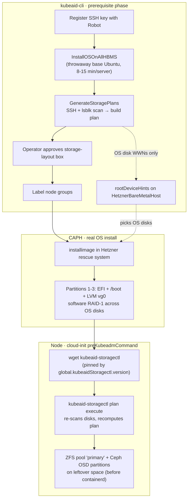

# Bare-metal provisioning

How Hetzner bare-metal nodes get their OS and disk layout. The last
section is a proposed improvement; everything before it is how kubeaid-cli
works today.

## Overview

Provisioning runs in two tools across three phases. kubeaid-cli only
prepares the ground and picks the OS disks; CAPH does the real OS
install; the node itself carves ZFS + Ceph on first boot.



> The storage plan kubeaid-cli builds in the prerequisite phase is
> mostly informational — only the OS disk selection reaches CAPH (via
> `rootDeviceHints`). The node recomputes its own ZFS/Ceph plan when
> `kubeaid-storagectl` runs.

## OS install

CAPH installs the OS on bare-metal nodes, not kubeaid-cli.

kubeaid-cli renders these values for the capi-cluster chart:

```
bareMetal:
  wipeDisks: <bool>
  installImage:
    imagePath: <Ubuntu image>
    vg0:
      size: <GB>
      rootVolumeSize: <GB>
```

The chart turns that into a `HetznerBareMetalMachineTemplate`. Its
`installImage` block is a normal installimage config: an EFI partition, a
`/boot` partition, an LVM group `vg0` of `vg0.size` GB with a root volume
of `rootVolumeSize` GB, software RAID-1 across the OS disks, and a
post-install script. CAPH boots each host into the Hetzner rescue system
and runs installimage there. If `wipeDisks` is set, it wipes every disk on
the host first.

`vg0` is not the whole disk. installimage only carves the EFI, `/boot` and
`vg0` partitions, so the rest of the disk is left unpartitioned. OS
upgrades reuse this path; `upgrade_cluster.go` just points `installImage`
at a new image.

> **⚠️ `wipeDisks` and OS upgrades — data loss.** Because OS upgrades reuse the
> installimage path above, a re-image with `wipeDisks: true` secure-erases *every*
> disk on each node — including the Ceph OSD partitions and the ZFS node-local pool.
> So `wipeDisks` defaults to **false**. Set it `true` only for an initial install on
> recycled disks (to clear stale Ceph/bluestore that would otherwise deadlock OSD
> provisioning), and **set it back to `false` before any OS upgrade** — otherwise the
> upgrade re-image wipes all data on every node.

## Storage (ZFS / Ceph)

The ZFS and Ceph layout is not part of `installImage`. It happens on the
node, after the OS is up.

A `preKubeadmCommand` in the chart (`KubeadmConfig` for node groups,
`KubeadmControlPlane` for the control plane) downloads the
`kubeaid-storagectl` binary from kubeaid-cli's GitHub releases and runs
`kubeaid-storagectl plan execute`. That carves the leftover disk space
into the ZFS pool and the Ceph partition. It runs during cloud-init,
before containerd is installed, so containerd's data lands on ZFS.

The storagectl version is pinned by `global.kubeaidStoragectl.version`.
kubeaid-cli sets it to its own release version; dev builds leave it empty
and the chart falls back to `latest`.

## The storage plan

kubeaid-cli builds a storage plan during the prerequisite phase, but it is
mostly informational. The plan stays in memory and is never written to
general.yaml. kubeaid-cli uses it for the approval box shown to the
operator, and to label node groups. The ZFS and Ceph allocations never
reach CAPH; the node recomputes its own plan when `kubeaid-storagectl`
runs.

The one part of the plan that does reach CAPH is the OS disk selection.
kubeaid-cli writes the OS disks' WWNs into each `HetznerBareMetalHost`'s
`rootDeviceHints`, so CAPH builds the OS RAID on the right disks.

## kubeaid-cli's prerequisite phase

For bare-metal, `ProvisionPrerequisiteInfrastructure` does four things:

1. Register the SSH key with Hetzner Robot.
2. `InstallOSOnAllHBMS`: for each server, skip it if it is already
   SSH-reachable, otherwise install a base Ubuntu (Robot's one-shot Linux
   install) and wait for it to come up.
3. `GenerateStoragePlans`: SSH into each server, scan its disks, build the
   storage plan, and show the operator the approval box.
4. Label the node groups.

## The throwaway double-install

Step 2 is wasteful. It runs a full OS install, 8 to 15 minutes per server,
only to get the server SSH-reachable so step 3 can scan its disks. CAPH
then installs the OS again. Every bare-metal server ends up installed
twice.

The skip check, `isHBMSReachable`, is also cluster-blind. A server still
running another cluster's OS answers SSH and gets skipped, so the scan
runs against whatever is on it. That is harmless in practice, since
`lsblk` reports the disks correctly either way and CAPH wipes and
reinstalls anyway. The install itself is still pure waste.

## Recovering from a `CheckDisk failed` permanent error

CAPH runs a SMART pre-flight against every drive listed in
`rootDeviceHints.raid.wwn` before installimage. If any drive reports any
SMART warning — current OR historical — the host is marked
`provisioningState: image-installing` with `errorType: permanent error`
and CAPH stops reconciling it. The event looks like:

```
CheckDisk failed (permanent error): CheckDisk for [0x...] failed:
  0x... (/dev/sda): Please note the following marginal Attributes:
  0x... (/dev/sda): 190 Airflow_Temperature_Cel ... In_the_past 32
```

The `WHEN_FAILED` column is the key signal:

- `FAILING_NOW`        — drive is failing right now. **Do not ignore.**
  Open a Hetzner Robot ticket and have the disk swapped before
  proceeding.
- `In_the_past`        — drive once crossed the threshold and has since
  recovered. Safe to ignore for a worker node carrying stateless
  workloads; weigh more carefully for control-plane / etcd nodes since
  they hold persistent state.
- empty / `-`          — informational only, no threshold ever crossed.

To unblock a host whose only warning is historical, set both
annotations in a single call:

```bash
kubectl -n capi-cluster annotate hetznerbaremetalhost <serverID> \
  capi.syself.com/ignore-check-disk=true \
  capi.syself.com/permanent-error- \
  --overwrite
```

- `ignore-check-disk=true` tells CAPH to skip the SMART gate on the
  next reconcile.
- `permanent-error-` (trailing `-` removes the annotation) clears the
  "I gave up" sticky marker CAPH set after `errorCount` hit threshold.
  Without removing this, CAPH won't reconcile the host at all and the
  ignore-check-disk annotation goes unread.

Within ~30 seconds the host should leave `permanent-error` and CAPH
will re-attempt installimage.

After the disk is replaced (Hetzner Robot disk swap), revert by
removing the ignore annotation so future SMART regressions surface:

```bash
kubectl -n capi-cluster annotate hetznerbaremetalhost <serverID> \
  capi.syself.com/ignore-check-disk- --overwrite
```

Nothing in `general.yaml` or kubeaid-cli's render pipeline changes
either way — these annotations live entirely in the CAPH state, so
a kubeaid-cli re-run won't clobber them.

## Possible improvement

The throwaway install only exists to make an unreachable server SSH-able
so we can run `lsblk` on it. The Hetzner rescue system does that far
faster: it is a full Debian environment with `lsblk` already present, and
apt is there if some tool is missing.

So step 2 can boot rescue instead of installing an OS:

```
for each server:
  SSH reachable   -> scan it now
  not reachable   -> boot it into rescue, then scan
```

The scan is read-only: `lsblk` reads disk sizes, WWNs and disk type. So
`GenerateStoragePlans` does not change at all. It does not care whether it
SSH'd into rescue or into an installed OS. Nothing is installed in the
prerequisite phase, and CAPH still does the real install afterwards. This
replaces an 8-15 minute install with a 1-2 minute rescue boot, and the
only code that changes is the "not reachable" branch of
`InstallOSOnAllHBMS`.

There is a heavier alternative. CAPH inspects each `HetznerBareMetalHost`
and lists its disks under `HardwareDetails`, so kubeaid-cli could read
that and skip scanning altogether. But `HardwareDetails` is only filled in
after the host is registered and CAPH has run, so kubeaid-cli would have
to create the `HetznerBareMetalHost` objects before building the storage
plan, which reorders the bootstrap. Rescue-scan needs none of that, so it
is the better first step.
