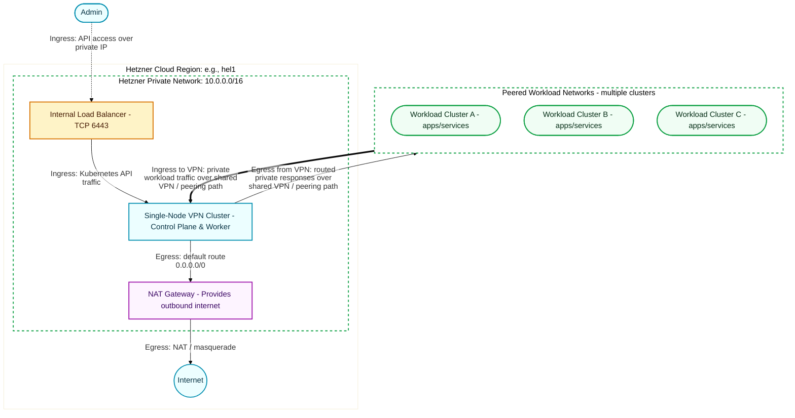

# Hetzner HCloud Single-Node VPN Cluster

This document outlines the architecture, networking, and configuration required to provision a single-node VPN cluster on Hetzner Cloud (HCloud) using KubeAid CLI and the accompanying `@KubeAid/argocd-helm-charts`.

## 1. Overview
When the cluster `type` is set to `vpn` in the KubeAid `general.yaml` configuration, KubeAid provisions a Kubernetes cluster tailored for acting as a VPN gateway. This VPN cluster connects workload clusters using Hetzner Networks, allowing private networking without exposing internal workloads to the public internet.

For a single-node VPN cluster, the control plane node also handles workload execution (no separate worker nodes), maintaining a lightweight footprint.

### Architecture Diagram



## 2. Network and Infrastructure Components

The VPN cluster relies on several infrastructural elements. These elements are orchestrated between the `kubeaid-cli` pre-provisioning phase and the `capi-cluster` Helm chart managed by ArgoCD.

### A. Hetzner Private Network
* **Purpose**: Isolates internal cluster traffic. For VPN clusters, this network is shared with (or routed to) workload clusters to allow private traffic flow.
* **Code Reference (kubeaid-cli)**: `pkg/cloud/hetzner/network.go` -> `CreateNetwork()`. KubeAid creates a Hetzner Network before ClusterAPI takes over.
* **Config Reference**: `general.yaml` under `cloud.hetzner.hcloud.hetznerNetwork`.
* **Helm Reference**: `argocd-helm-charts/capi-cluster/charts/hetzner/templates/HetznerCluster.yaml`. The `HetznerCluster` custom resource (CR) instructs ClusterAPI to use the pre-provisioned network (`spec.hcloudNetwork.enabled: true`).

### B. NAT Gateway
* **Purpose**: Since nodes are often placed in a private network without public IPv4, a NAT Gateway is required to provide outbound internet access (e.g., pulling container images).
* **Code Reference (kubeaid-cli)**: `pkg/cloud/hetzner/server.go` -> `CreateNATGateway()`. Provisions a small `cax11` VM, configures `iptables` for `MASQUERADE`, and adds a `0.0.0.0/0` route via this server in the Hetzner Network.
* **Helm Reference**: `argocd-helm-charts/capi-cluster/charts/hetzner/templates/KubeadmConfigTemplate.yaml`. Nodes run a `preKubeadmCommand` script (`/connect-nat-gateway.sh`) to route default traffic through the NAT Gateway.

### C. Single-Node Control Plane
* **Purpose**: The Kubernetes control plane. By specifying `replicas: 1` and omitting node groups, this node also acts as the sole worker node.
* **Helm Reference**: `argocd-helm-charts/capi-cluster/charts/hetzner/templates/HCloudMachineTemplate.yaml` (Control Plane Machine Template).
* **Validation Code**: `pkg/config/parser/validate.go`. Validates that if `Cluster.Type == "vpn"`, the provider MUST be `hetzner` and mode MUST be `hcloud`. 

### D. Cloud Controller Manager (CCM)
* **Purpose**: Integrates Kubernetes with Hetzner Cloud APIs. In a VPN cluster, the CCM manages network routes for Pod IPs in the private Hetzner Network.
* **Helm Reference**: `@KubeAid/argocd-helm-charts/ccm-hetzner/charts/ccm-hetzner` chart.
* **Configuration Mapping**: `kubeaid-cli/pkg/core/templates/argocd-apps/values-ccm-hetzner.yaml.tmpl`. For VPN clusters (`.ClusterConfig.Type == "vpn"`), it explicitly sets `networking.enabled: true` and passes the Hetzner network ID via a Kubernetes secret. This ensures that the CCM configures Hetzner Cloud routes for internal pod-to-pod communication.

### E. Internal Load Balancer (Optional)
* **Purpose**: If a Load Balancer is used for the API server, it can be configured to use private IPs so it isn't exposed to the public internet, maximizing security.
* **Configuration Mapping**: `kubeaid-cli/pkg/core/templates/argocd-apps/values-ccm-hetzner.yaml.tmpl` injects specific environment variables (`HCLOUD_LOAD_BALANCERS_DISABLE_PUBLIC_NETWORK="true"` and `HCLOUD_LOAD_BALANCERS_USE_PRIVATE_IP="true"`) to enforce internal-only load balancing when connected to a VPN cluster.

## 3. Example Configuration Snippet

Here is an example `general.yaml` snippet to configure a single-node VPN cluster on HCloud:

```yaml
cluster:
  type: vpn
  name: my-vpn-cluster
  k8sVersion: v1.34.0
  # ... other cluster settings ...

cloud:
  hetzner:
    mode: hcloud
    sshKeyPair:
      name: cluster-bootstrapper
      privateKeyFilePath: ~/.ssh/id_ed25519
    hcloud:
      zone: eu-central
      imageName: ubuntu-24.04
      hetznerNetwork:
        cidr: "10.0.0.0/16"
        hcloudServersSubnetCIDR: "10.0.0.0/24"
    controlPlane:
      regions:
        - hel1
      hcloud:
        machineType: cax21
        replicas: 1 # 1 replica for single-node cluster
        loadBalancer:
          enabled: true
          region: hel1
    nodeGroups:
      hcloud: [] # Empty list as workloads run on control plane
      bareMetal: []
```
