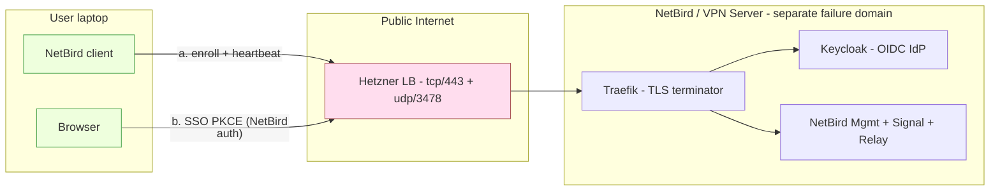
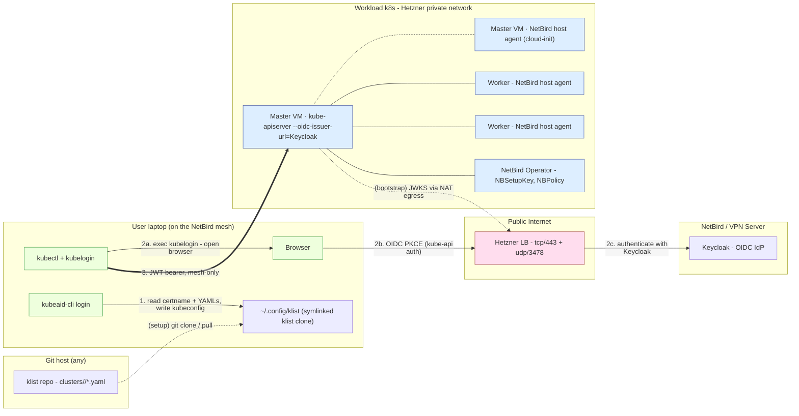
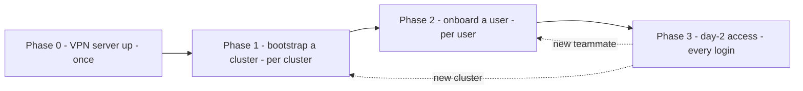
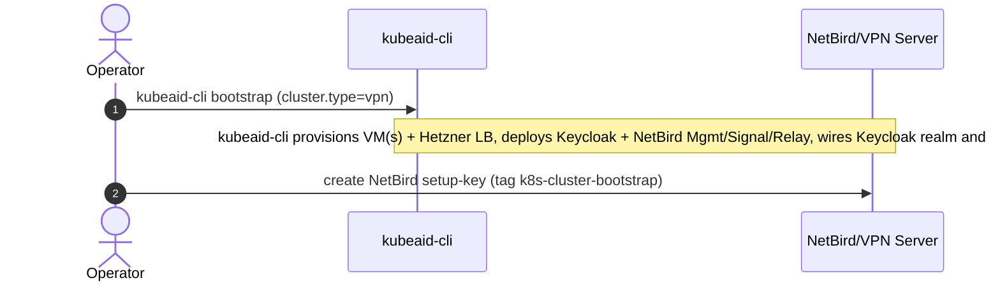
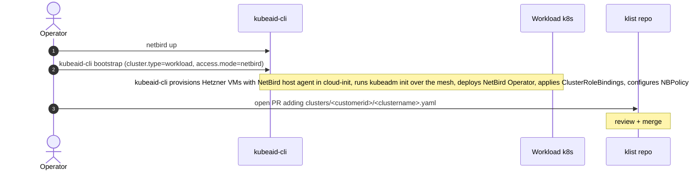
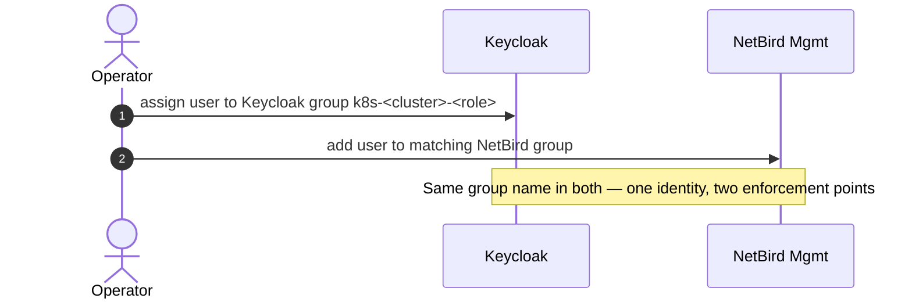
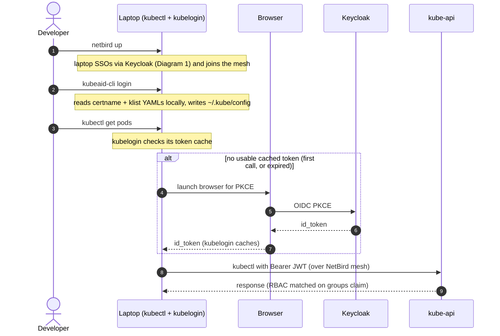

# Hetzner k8s with NetBird-gated kube-api — architecture

> Hetzner HCloud cluster (single-node or 3-node HA control plane) where `kube-apiserver:6443` is never exposed publicly.  
> NetBird gates network access; Keycloak is the OIDC IdP; kube-apiserver consumes Keycloak natively via `--oidc-issuer-url`.  
> Outcome for end users: Teleport-style "session with role", built from off-the-shelf parts.

See also: [architecture.md](./architecture.md) for the broader KubeAid CLI architecture.

## Context

The setup, at a glance:

- **Cluster** — Hetzner HCloud Kubernetes. Either a single control-plane node, or a 3-node HA control plane.
- **Public surface** — `kube-apiserver:6443` is sealed off from the public internet. It lives only on the NetBird WireGuard mesh.
- **Network gate** — NetBird. The laptop must be on the mesh before kube-api is even reachable.
- **Identity gate** — Keycloak. `kube-apiserver` runs with `--oidc-issuer-url` pointing at Keycloak, so it validates JWTs natively.
- **kubectl flow** — once the laptop is on the mesh, `kubectl` talks to kube-api directly and presents an OIDC token from Keycloak. Stock Kubernetes OIDC, nothing custom.

Topology notes:

- Single-node and 3-node HA share the exact same architecture.
- The only thing that changes between them is how many control-plane VMs run the NetBird host agent.
- Workers always run the agent, in either topology.

### Already in this repo
- HCloud control-plane LB is created with `PublicInterface: false` (`pkg/cloud/hetzner/loadbalancer.go:46`).
- A `vpn` cluster type is defined in config (`pkg/config/general.go:106`) — this design wires it up so `kubeaid-cli bootstrap` with `cluster.type=vpn` provisions the NetBird/VPN server itself (Phase 0).

### Not yet present (this design adds)
- NetBird
- Keycloak
- OIDC wiring for `kube-apiserver`
- The `klist` registry consumer
- The `kubeaid-cli login` subcommand

The stacked code branch implements all of them.

## Three planes

The whole design splits into three independent planes, each with one responsibility:

**1. NetBird / VPN Server** — the only thing publicly reachable.
- Separate VM, own failure domain (so a workload-cluster outage can't take down auth).
- Provisioned by `kubeaid-cli` with `cluster.type=vpn`.
- Sits behind one Hetzner LB + Traefik (TLS termination + path routing).
- Hosts Keycloak (OIDC IdP) + NetBird Mgmt / Signal / Relay.

**2. Workload k8s cluster** — the actual Kubernetes cluster, with no public surface.
- 1 or 3 control-plane nodes + N workers, all in a Hetzner private network.
- NetBird host agent on every node (control-plane and workers).
- NetBird Operator in-cluster — exposes `kube-apiserver` as a NetBird mesh resource.
- `kube-apiserver` configured with `--oidc-issuer-url=https://keycloak.<vpn-server>` (plus `--oidc-groups-claim=groups`, `--oidc-username-claim=email`), so it validates Keycloak JWTs natively. Cert SANs include `k8s-X.netbird` (the mesh DNS name).

**3. User laptop** — the developer's workstation.
- NetBird client — joins the WireGuard mesh on `netbird up`.
- `kubectl` with the `kubelogin` exec plugin — handles OIDC PKCE + token refresh against Keycloak.
- `kubeaid-cli login` — a small helper that writes a kubeconfig stub. No tokens, no OIDC, no network calls — purely local I/O.

### What NetBird gives us natively (and what it doesn't)

NetBird has an official [Kubernetes Operator](https://docs.netbird.io/how-to/kubernetes-operator). It covers the network side cleanly but stops short of identity.

**What we use from it:**
- **Host agent on every node** — joins each node to the mesh via a setup key (installed on master + workers via cloud-init).
- **`netbird.io/expose: "true"` Service annotation** — Operator publishes `kubernetes.default` as a mesh DNS resource (`k8s-X.netbird`).
- **`NBPolicy` CRD** — declarative ACLs: group `k8s-cluster-X-*` reaches resource `k8s-X.netbird`.
- **`NBSetupKey` CRD + sidecar injection** — annotate a pod with `netbird.io/setup-key` to inject a mesh sidecar. Optional, for pods that need outbound mesh egress.

**What's missing — Keycloak fills it:**
- No OIDC for `kube-apiserver` — Keycloak is the IdP; kube-api consumes its JWTs natively via `--oidc-issuer-url`. No custom auth-broker.
- No k8s RBAC integration — Keycloak's `groups` claim drives standard `ClusterRoleBinding`s.

NetBird = network gate. Keycloak = identity.

### Cluster registry — `klist`

- A Git repo at <https://gitea.obmondo.com/EnableIT/klist>. One YAML per cluster, organised by customer.
- No runtime registry service — everything lives in the repo.
- `kubeaid-cli login` reads it **locally**: the user keeps a checkout symlinked to `~/.config/klist` (override via `--registry` or `KUBEAID_REGISTRY`).
- Cluster lookup is by **puppet certname** — direct file read, no picker.
- The [klist README](https://gitea.obmondo.com/EnableIT/klist) is the source of truth for the YAML schema, the certname-bisect rule, the contribution flow, and the kubeconfig anatomy `login` produces. This doc only references them.

## Network diagrams

Two diagrams. The first shows the precondition (get on the NetBird mesh — done once per session). The second shows the main flow (`kubeaid-cli login` + `kubectl`).

### Diagram 1 — NetBird mesh login (precondition)

`netbird up` puts the laptop on the WireGuard mesh by SSO-ing the user against Keycloak. After this step the laptop has a NetBird IP and can resolve / reach `k8s-X.netbird:6443`. Nothing else in this design works until this finishes.

Result: the laptop holds a NetBird-issued IP and a peer relationship with the master.

### Diagram 2 — kubeaid-cli login + kubectl (the main flow)

Assumes the NetBird mesh is already up (Diagram 1). Three numbered steps drive the daily flow; edges marked `(setup)` / `(bootstrap)` happen out-of-band — per-laptop or per-cluster, not per-session.

The master VM is drawn as two boxes connected by a dotted line — same VM, two independent roles (`kube-apiserver` for auth, NetBird host agent for network). The split is visual; it makes the auth-vs-network gate split easier to read off the diagram.

## The full flow

Four phases. Phase 0 happens once. Phase 1 happens per cluster. Phase 2 happens per user. Phase 3 happens every workday.

Each phase below is the **user-visible** flow. Anything kubeaid-cli does internally (Hetzner API calls, kubeadm init, manifest rendering, ArgoCD wiring, etc.) is collapsed into a single bootstrap step — the operator/developer only types a small number of commands.

### Phase 0 — NetBird/VPN Server provisioning (once)

### Phase 1 — Cluster bootstrap (per cluster)

### Phase 2 — Onboard a user (per user)

### Phase 3 — Day-2 access (every workday)

### Two enforcement points, one identity

The same group name (`k8s-cluster-X-dev`) gates both layers — belt and suspenders:

- **Network** — NetBird `NBPolicy` on resource `k8s-X.netbird`. Remove user from the NetBird group → reachability drops **immediately**.
- **Auth/RBAC** — OIDC `groups` claim → `ClusterRoleBinding`. Remove user from the Keycloak group → 403 from kube-apiserver on the next token refresh (≤5 min).

### Namespace-scoped access

Keycloak handles identity; k8s RBAC handles authorization. To give a user rights in only some namespaces, encode the namespace in the group name and bind it via a `RoleBinding` (namespace-scoped) rather than a `ClusterRoleBinding`.

- **Group naming convention** (Keycloak + NetBird): `k8s-<cluster>-<namespace>-<role>` — e.g. `k8s-prod-payments-developer`, `k8s-prod-billing-readonly`.
- **Bind in the target namespace:** a `RoleBinding` in `payments` referencing `oidc:k8s-prod-payments-developer` → ClusterRole `developer` grants only that namespace's rights to anyone in that group.
- **A user can be in multiple namespace groups** at once. k8s RBAC ORs the matches, so the user gets the union of rights.
- **Revoking a single namespace** = removing the user from that one group. The other namespace memberships are untouched, no cluster-level change needed.

For cluster-wide roles (cluster-admin, view across everything), keep using `ClusterRoleBinding` with broader group names (e.g. `k8s-prod-admin`). The two coexist — pick whichever scope each role needs.

### Session lifetime — "X hours per login"

Three Keycloak settings on the `kubernetes` OIDC client govern how long one login lasts:

| Setting | Recommended | Effect |
|---|---|---|
| Access token lifespan | 5 min | `kubelogin` silently refreshes the bearer at this cadence |
| Client session max | 8h | Hard cap — re-auth via browser PKCE required after this |
| SSO session idle | 30 min | Refresh fails after 30 min idle → forces re-auth earlier |

A developer logging in at 09:00 has unattended `kubectl` until 17:00. Walking away for 30+ minutes triggers re-auth sooner.

**Per-cluster TTL** — one Keycloak OIDC client per cluster (`kubernetes-staging` 8h, `kubernetes-prod` 4h, etc.). Each cluster's `--oidc-client-id` flag and the kubeconfig stub written by `kubeaid-cli login` reference the matching client.

For revoking access mid-session or for the next session, see **[Two enforcement points, one identity](#two-enforcement-points-one-identity)** above.

## Why this shape (the missing elements made explicit)

- **Identity provider exists at all.** NetBird is *not* an OIDC IdP — it delegates to one. Keycloak is the actual identity source, used by both NetBird (for VPN auth) and kube-apiserver (via the `--oidc-issuer-url` flag). One IdP, two consumers, same group claims.
- **kube-api authenticates via standard OIDC.** No custom broker, no CSRs. The user-flow is plain `kubectl` + `kubelogin` — a well-trodden k8s pattern. "Session-bound role" comes from short-lived id_tokens (typically 5 min, refreshed transparently).
- **`kubeaid-cli login` is small.** It resolves a single cluster from the local klist clone using the puppet certname and writes a correctly-formed kubeconfig. It does not handle tokens, OIDC, or RBAC — those are kubelogin's and Keycloak's jobs.
- **NetBird/VPN Server is separate from the workload cluster.** Avoids the loop where you need cluster access to fix cluster access. If the workload cluster dies, you can still authenticate, debug, and re-bootstrap.
- **Single public ingress.** Only the NetBird/VPN Server is reachable on the internet. Workload cluster has zero public attack surface beyond NetBird's WireGuard handshake on the relay.
- **Bootstrap chicken-and-egg solved by cloud-init.** NetBird agent is installed and enrolled on each node *during boot* via a setup key. The laptop running kubeaid-cli is itself a NetBird peer, so the local k3d bootstrap cluster reaches the new master through the same mesh path kubectl will later use. No temporary public 6443 needed.
- **Network and identity are decoupled but consistent.** Same group name in both systems. NetBird drops packets if you're not in the group; kube-apiserver returns 403 if your token does not carry the matching claim. Defense in depth.

## Trade-offs accepted

- **kube-api needs egress to Keycloak's JWKS** (one-time on startup, cached after). This goes out via Hetzner NAT egress to the public LB → Traefik → Keycloak. Acceptable.
- **Token revocation latency** = OIDC token TTL (default 5 min). For instant cut, removing the user from the NetBird group also cuts network access immediately, so revocation is effectively instant in practice.
- **Single-control-plane topology trades availability for cost.** For the 1-node variant, a master reboot or NetBird-agent failure on that node makes kube-api unreachable until the agent and operator come back via systemd. Acceptable for non-prod / cost-sensitive use; pick the 3-node HA topology when that downtime is unacceptable. The HA path inherits the same network/auth shape — only the count of NetBird-enrolled control-plane VMs changes.

