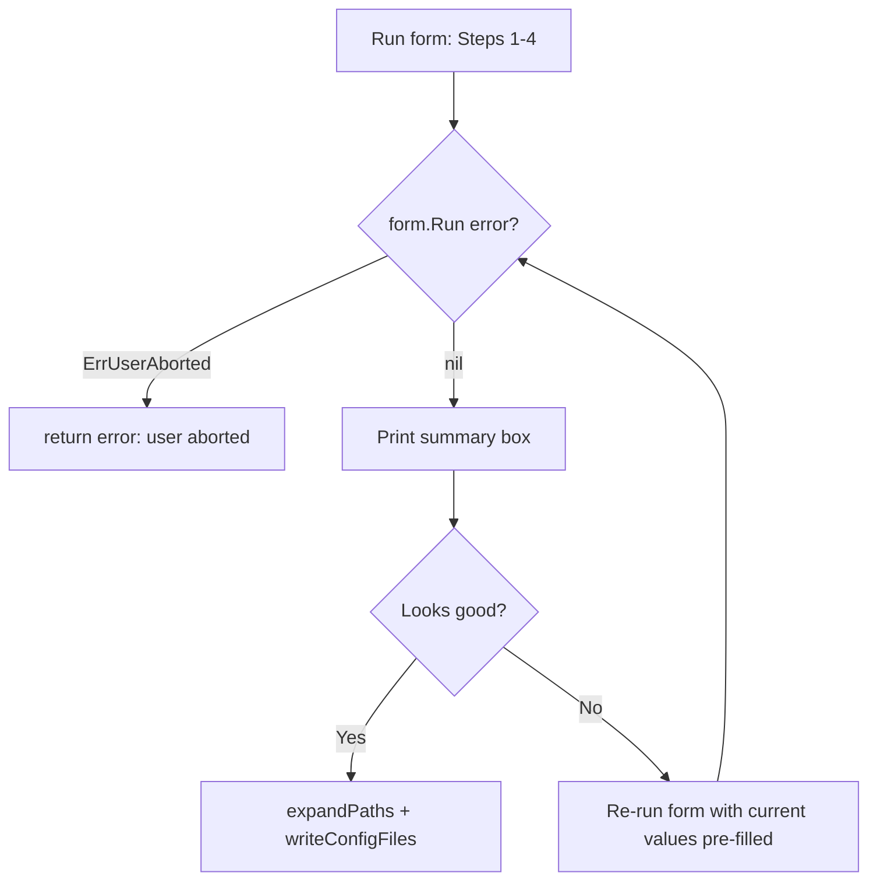

# Prompt UX Redesign

## Overview

The `kubeaid-cli cluster bootstrap` interactive prompt is being refactored from
a flat sequence of ~14 single-question screens into a grouped multi-field form
flow. The goals are: reduced operator fatigue, inline field grouping, a progress
indicator, inline validation with per-field errors, and the ability to edit
answers from the summary before writing config files.

The underlying schema (`PromptedConfig`, `general.yaml.tmpl`, `secrets.yaml.tmpl`)
is unchanged. The output YAML must be byte-equivalent for a given set of answers.

---

## Group breakdown

The new flow uses `huh.NewForm` with five `huh.NewGroup` pages. A "Step N/M"
description on each group replaces the old printed section headers.

```
Step 0/4 — K8s version profile   (table + huh.NewSelect over Proven /
                                   Balanced ★ / Early Adopter / Bleeding Edge)
Step 1/4 — Cluster basics        (provider, cluster name, cluster kind)
Step 2/4 — VPN endpoints         (Keycloak mode, DNS names, CP endpoint, ACME
                                   email) — HIDDEN when ClusterType != "vpn"
         — OIDC (optional)       (enable toggle + issuer URL + client ID) —
                                   shown when ClusterType == "workload" and
                                   Hetzner or any provider
Step 3/4 — Cloud credentials     (provider-specific: tokens, region, HA toggle)
Step 4/4 — Git / SSH             (ArgoCD deploy key, config repo URL, Git SSH
                                   key — conditional on SSH agent availability)
Review   — Summary confirm       ("Looks good?" confirm inside the form)
```

### Step 0 — K8s version profile

Replaces today's silent "latest-1 minor" auto-pick with an explicit
trade-off table. Four profiles map to positions in K8s's support
window relative to the current latest minor:

| Profile        | Position             | Risk         | Note                                |
|----------------|----------------------|--------------|-------------------------------------|
| Proven         | current minor − 2    | Lowest       | battle-tested                       |
| Balanced ★     | current minor − 1    | Low          | 3 mo of stability — default pick    |
| Early Adopter  | current minor, .1+   | Medium-High  | community shakes out bugs first     |
| Bleeding Edge  | current minor, .0    | High         | day-one — breaking changes possible |

"Current minor" comes from `dl.k8s.io/release/stable.txt`; on network
failure the picker falls back to the highest cycle in the embedded
EOL data (`pkg/config/parser/k8s-eol.json`) and prints a one-line
note in the table. Concrete patch versions are pulled from the same
embedded EOL data — Proven and Balanced rows are marked unavailable
when the EOL JSON doesn't carry the corresponding cycle (rare, but
possible if the embedded file lags upstream).

Renders with `lipgloss.NewTable` (rounded border, header row in
bold, Balanced row highlighted with bold + background tint 236) so
the recommended pick is visually obvious. Operator picks via
`huh.NewSelect`; Balanced is preselected, the cursor lands on it on
first render.

Picked version overrides `cfg.K8sVersion` before the Step 1 form
fires. On Ctrl+C / huh error / total fallback failure the silent
autodetect default is preserved so we never write an empty version
into general.yaml.

Provider-specific credential groups (AWS, Azure, Hetzner, bare-metal) are
rendered as a single group per provider, gated by `WithHideFunc` on the
cluster's `CloudProvider` value.

---

## Field placement map

| Old position | Field | New group |
|---|---|---|
| (silent autodetect) | K8s version | Step 0 — K8s version profile |
| 1 | Cloud provider | Step 1 — Cluster basics |
| 2 | Cluster name | Step 1 — Cluster basics |
| 3 | What are you setting up? (cluster kind) | Step 1 — Cluster basics |
| 4 | Keycloak mode | Step 2 — VPN endpoints (hidden unless vpn) |
| 5 | Keycloak DNS | Step 2 — VPN endpoints |
| 6 | NetBird DNS | Step 2 — VPN endpoints (auto-derived default) |
| 7 | Control-plane endpoint | Step 2 — VPN endpoints (auto-derived default) |
| 8 | ACME email | Step 2 — VPN endpoints (auto-derived default) |
| 9 | Mode (hcloud/bare-metal/hybrid) | Step 3 — Cloud credentials (Hetzner) |
| 10 | Cloud API token | Step 3 — Cloud credentials (Hetzner) |
| 11 | SSH private key file path | Step 3 — Cloud credentials (Hetzner) |
| 12 | Enable HA? | Step 3 — Cloud credentials |
| 13 | ArgoCD deploy key | Step 4 — Git / SSH |
| 14 | KubeAid Config fork URL | Step 4 — Git / SSH |
| (conditional) | Git SSH private key | Step 4 — Git / SSH |

The OIDC group (workload-only) sits between Step 2 and Step 3 and is hidden
when `ClusterType == "vpn"` (VPN clusters auto-derive OIDC from Keycloak DNS).

---

## Auto-derive behaviour change

`huh.NewForm` resolves field `Value` pointers at construction time, not between
fields within the same group. This means Keycloak DNS and the derived fields
(NetBird DNS, CP endpoint, ACME email) cannot live in the same group if we want
the derives to pre-fill based on what the operator typed.

The solution: split VPN into two groups.

- **VPN group A** (Step 2a): Keycloak mode + Keycloak DNS — after this group
  completes, the form moves to group B.
- **VPN group B** (Step 2b): NetBird DNS, CP endpoint, ACME email — pre-filled
  via the derive helpers before this group renders.

To achieve this, the derive logic runs in a `huh.Group.WithHideFunc` callback
equivalent: after the form returns from group A, `ConfigFromPrompt` runs the
derive logic and re-invokes a second `huh.NewForm` for group B (with derived
defaults already set on `cfg`). This keeps the logic simple without requiring
any `DescriptionFunc` / `SuggestionsFunc` hacks.

In practice the operator will see:

```
Step 2a/4 — Keycloak setup   [Keycloak mode + Keycloak DNS]
     (form advances, derives run in Go)
Step 2b/4 — VPN endpoints    [NetBird DNS*, CP endpoint*, ACME email*]
     (* pre-filled, operator can accept by pressing Enter/Tab)
```

For the re-run (edit-from-summary) loop the derives re-run each iteration from
the current `cfg.KeycloakDNS` value, so edited values propagate correctly.

---

## Edit-from-summary loop



The "Looks good?" confirm is a `huh.NewConfirm` at the end of the last group
(Step 4 Git/SSH), not a separate `printSummaryAndConfirm` call. When the
operator picks "No", `ConfigFromPrompt` loops: the form re-runs with all
`*string` / `*bool` pointers still pointing at the already-filled `PromptedConfig`
fields, so every field shows the last answer as its default. The operator can
tab to any field and change it.

The summary box (`printBox`) is still printed before each "Looks good?" confirm
so the operator sees a clean overview on each loop iteration.

---

## What changes in each file

| File | Change |
|---|---|
| `prompt.go` | Replace sequential `promptX()` calls with `huh.NewForm` groups; add edit loop |
| `helpers.go` | `requiredInput`, `requiredPassword`, `optionalInput`, `confirm`, `selectOption` become dead code — removed; derive helpers (`stripFirstLabel`, `deriveACMEEmailFromDNS`, `deriveRealmFromDNS`) stay |
| `prompt_helper.go` | `printSectionHeader` removed; `printSummaryAndConfirm` extracted to `printBox` only — confirm moved into form |
| `provider_hetzner.go` | `promptHetznerQuestions` rewritten as `buildHetznerGroup() *huh.Group` |
| `provider_aws.go` | `promptAWSQuestions` rewritten as `buildAWSGroup() *huh.Group` |
| `provider_azure.go` | `promptAzureQuestions` rewritten as `buildAzureGroup() *huh.Group` |
| `provider_baremetal.go` | No prompted fields — stays as-is (sets defaults programmatically) |
| `provider_local.go` | No prompted fields — stays as-is |
| `provider.go` | `ProviderPrompter` interface gains `BuildGroup(*PromptedConfig) *huh.Group`; `PromptConfig` removed; `baseProvider` adapts |
| `e2e/prompt/prompt_test.go` | Input sequence updated to match grouped flow; `selectOption` indices stay the same; new "step" description strings added to `expectString` assertions |

---

## Constraints confirmed

- `huh` v1.0.0 only — `Group.WithHideFunc` and `Group.Title`/`Description` are available.
- `PromptedConfig` struct fields unchanged.
- `general.yaml.tmpl` and `secrets.yaml.tmpl` unchanged.
- `autodetect.go` unchanged.
- `provider_baremetal.go` and `provider_local.go` unchanged in behaviour.
